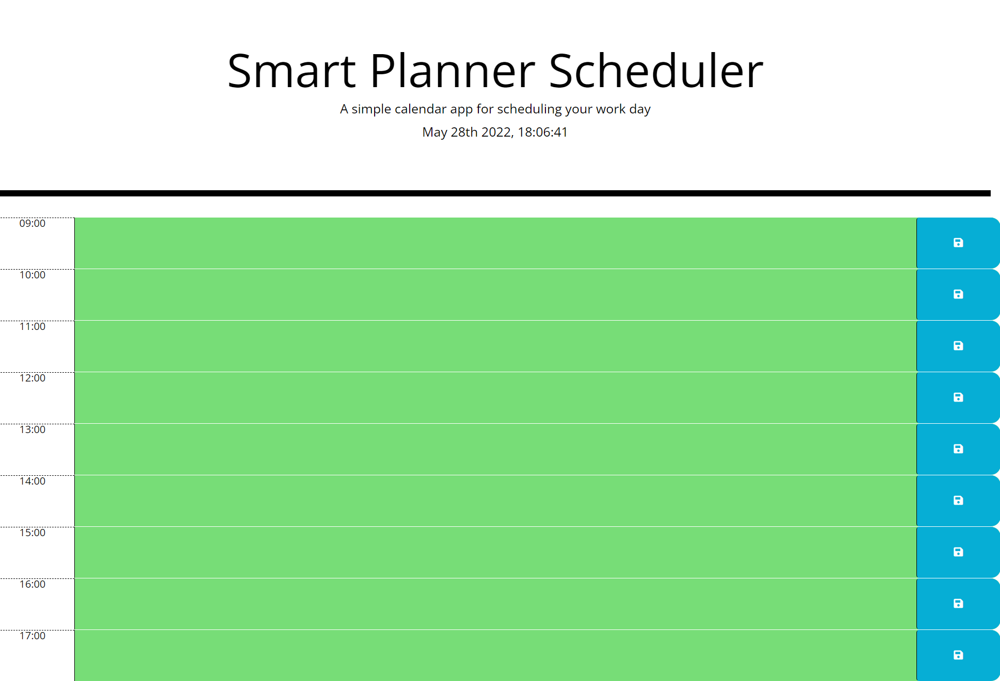

GIVEN I am using a daily planner to create a schedule
WHEN I open the planner
THEN the current day is displayed at the top of the calendar
WHEN I scroll down
THEN I am presented with timeblocks for standard business hours
WHEN I view the timeblocks for that day
THEN each timeblock is color coded to indicate whether it is in the past, present, or future
WHEN I click into a timeblock
THEN I can enter an event
WHEN I click the save button for that timeblock
THEN the text for that event is saved in local storage
WHEN I refresh the page
THEN the saved events persist

# Smart Planner Scheduler

## Description
Life is fast paced, and you need to keep your day organized. Welcome to the Smart Planner Scheduler. It will show you your day in a neat colorized way to keep you on track.  

## Installation

Follow these steps to install this project on your local machine.

- Open Bash editor
- mkdir dennislittlefieldportfolio
- cd dennislittlefieldportfolio
- git clone https://github.com/DLittlefield81/SmartPlanner.git

## Application

Link to Deployed Application: https://dlittlefield81.github.io/SmartPlanner/

## License

Non-Software Licenses
Open source software licenses can be also used for non-software works and are often the best choice, especially when the works in question can be edited and versioned as source (e.g., open source hardware designs). Choose an open source license here.

Data, media, etc.
CC0-1.0, CC-BY-4.0, and CC-BY-SA-4.0 are open licenses used for non-software material ranging from datasets to videos. Note that CC-BY-4.0 and CC-BY-SA-4.0 should not be used for software.

Documentation
Any open source software license or open license for media (see above) also applies to software documentation. If you use different licenses for your software and its documentation, be sure to specify that source code examples in the documentation are also licensed under the software license.

Fonts
The SIL Open Font License 1.1 keeps fonts open, allowing them to be freely used in other works.

Mixed projects
If your project contains a mix of software and other material, you can include multiple licenses, as long as you are explicit about which license applies to each part of the project. See the license notice for this site as an example.
